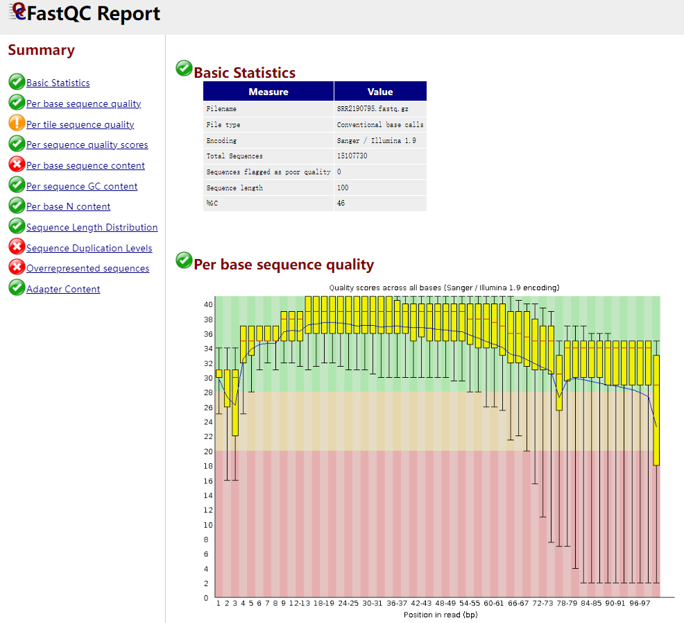
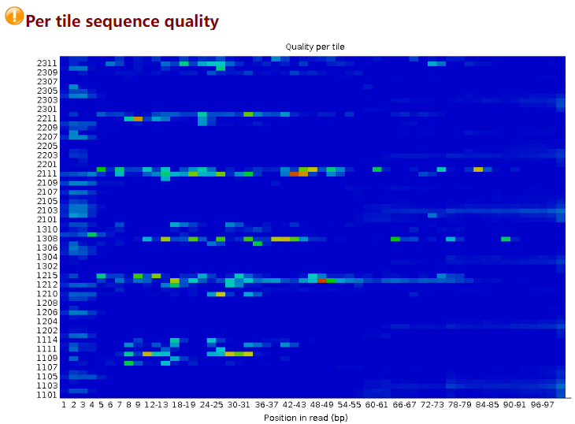
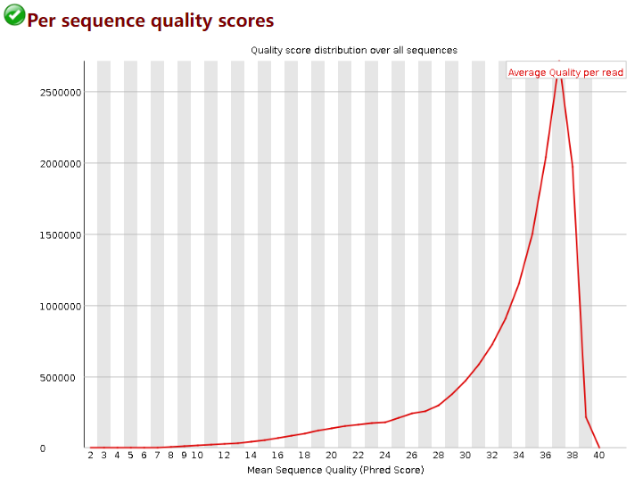

# some biosoft
## conda
  Conda是一种开源的软件包和环境管理软件，有两个主要的版本，Anaconda和Miniconda，前者包含一些常用软件包，后者是精简版，根据需要安装软件包。
  Miniconda 是一个 Anaconda 的轻量级替代，默认只包含了 python 和 conda，但是可以通过 pip 和 conda 来安装所需要的包。


## sratoolkit
sratoolkit 是NCBI提供的用于处理来自SRA数据库测序数据的一个工具包。

sratoolkit可以将.sra文件转换为 .fstaq.gz文件的工具。

注：sra是二进制文件，在Linux下如果用less去查看，它会显示这是个二进制文件，你是否确定打开它。一般我们分析测序数据，是用fastq文件打开分析，所以就需要转格式。

此外，可以利用prefetch命令从NCBI网站下载SRA accession no.的列表文件

注：SRA是NIH的高通量测序数据的主要档案，存档来自各种高通量测序平台的原始测序数据和比对信息，比如Illumina。

### prefetch命令

```bash
Usage:
  prefetch [options] <SRA accession | kart file> [...]
  Download SRA or dbGaP files and their dependencies
  
  prefetch [options] <SRA file> [...]
  Check SRA file for missed dependencies and download them

  prefetch --list <kart file> [...]
  List the content of a kart file
```


prefetch相关参数：(需要将prefetch -o参数改为-O，因为下载的是多个文件)

  -o|--output-file <file>          Write file to <file> when downloading single file
  -0--output-directory <directory) Save files to <directory>

### fastq-dump命令


## fastqc
高通量测序数据的高级质控工具
输入FastQ，SAM，BAM文件，输出对测序数据评估的网页报告
```bash
fastqc -t 12 -o out_path sample1_1.fq sample1_2.fq
```
-o --outdir:输出路径   
--extract：结果文件解压缩  
--noextract：结果文件压缩  
-f --format:输入文件格式.支持bam,sam,fastq文件格式  
-t --threads:线程数  
-c --contaminants：制定污染序列。文件格式 name[tab]sequence  
-a --adapters：指定接头序列。文件格式name[tab]sequence   
-k --kmers：指定kmers长度（2-10bp,默认7bp） -q --quiet： 安静模式

注：
SAM(Sequence Alignment/Map)格式是一种通用的比对格式，用来存储reads到参考序列的比对信息。
SAM是一种序列比对格式标准，由sanger制定，是以TAB为分割符的文本格式。主要应用于测序序列mapping到基因组上的结果表示，当然也可以表示任意的多重比对结果。
SAM分为两部分，注释信息（header section）和比对结果部分（alignment section）。

BAM文件是SAM文件的二进制形式

### fastqc输出文件解读
测序结果到手后，我们需要评估一下测序的质量，通常采用的质控软件组合就是fastqc和multiqc，fastqc可以快速多线程质控，并且输出html结果文件。

#### why fastqc
回归本源，测序数据为什么要进行质控？  
后期的所有分析都是基于测序数据展开的，测序数据质量的高低直接影响了我们分析的结果，因此在所有分析步骤之前，我们必须要对测序的数据的质量进行评价，只有达到我们的要求的测序数据才能用于下一步分析。

#### How to use fastqc
```bash
fastqc [-o output dir] [--(no)extract] [-f fastq|bam|sam] [-c contaminant file] seqfile1 .. seqfileN

Example：
nohup fastqc -o ./fastqc_70/ -f fastq clean_* &

常用参数解释：
# 主要是包括前面的各种选项和最后面的可以加入N个文件
# -o --outdir FastQC  生成的报告文件的储存路径，生成的报告的文件名是根据输入来定的
# -f --file  输入文件的格式，支持bam/sam/bam_mapped/sam_mapped/fastq|
# --extract  生成的报告默认会打包成1个压缩文件，使用这个参数是让程序不打包
# -t --threads 选择程序运行的线程数，每个线程会占用250MB内存，越多越快咯
# -c --contaminants  污染物选项，输入的是一个文件，格式是Name [Tab] Sequence  里面是可能的污染序列，如果有这个选项，FastQC会在计算时候评估污染的情况，并在统计的时候进行分析，一般用不到
# -a --adapters  也是输入一个文件，文件的格式Name [Tab] Sequence，储存的是测序的adpater序列信息，如果不输入，目前版本的FastQC就按照通用引物来评估序列时候有adapter的残留
# -q --quiet 安静运行模式，一般不选这个选项的时候，程序会实时报告运行的状况。
```

#### 输出文件解读
使用浏览器打开输出文件夹里的.html文件，会呈现图表化的fastqc报告：

图一：



##### Summary

图一左，Summary即整个报告的目录。绿色勾勾代表PASS；黄色感叹号代表WARN；红色勾勾代表FAIL。当出现黄色时说明需要查看结果。

##### Basic Statistics
图一右上
```bash
# Encoding 指测序平台的版本和相应的编码版本号
# Total Sequences 记录了输入文本的reads的数量
# Sequence length 测序长度
# %GC 表示整体序列中的GC含量
```
##### Per base sequence quality
图一右下
```bash
# 此图中的横轴是测序序列第1个碱基到第101个碱基
# 纵轴是质量得分，Q = -10*log10（error P）即20表示1%的错误率，30表示0.1%
# 图中每个boxplot，都是该位置的所有序列的测序质量的一个统计，上面的bar是90%分位数，下面的bar是10%分位数，箱子的中间的横线是50%分位数，箱子的上边是75%分位数，下边是25%分位数
# 图中蓝色的细线是各个位置的平均值的连线
# 一般要求此图中，所有位置的10%分位数大于20,也就是我们常说的Q20过滤
# 所以上面的这个测序结果，需要把67bp以后的序列切除，从而保证后续分析的正确性
# Warning 报警 如果任何碱基质量低于10,或者是任何中位数低于25
# Failure 报错 如果任何碱基质量低于5,或者是任何中位数低于20
```

##### Per tile sequence quality

```bash
# 横轴和之前一样，代表101个碱基的每个不同位置
# 纵轴是tail的Index编号
# 这个图主要是为了防止，在测序过程中，某些tail受到不可控因素的影响而出现测序质量偏低
# 蓝色代表测序质量很高，暖色代表测序质量不高，如果某些tail出现暖色，可以在后续分析中把该tail测序的结果全部都去除
```

##### Per sequence quality scores

```bash
# 假如我测的1条序列长度为101bp，那么这101个位置每个位置Q的平均值就是这条reads的质量值
# 该图横轴是0-40，表示Q值
# 纵轴是每个值对应的reads数目
# 实例数据中，测序结果主要集中在高分中，证明测序质量良好！
```

##### Per base sequence content


## multiqc
将fastqc的统计结果汇聚成一个网页可视化文件，便于查看
当比较多组的测序数据时，fastqc质控会产出的多份html文件，来回翻阅较为繁琐，为化繁为简，multiqc此时就可以上场了，multiqc会对质控结果进行整合，产出一份html文件，方便查阅。


## cutadapt
用于去除测序接头

## Trim Galore
使用perl脚本编写的工具，是对cutapater和fastqc命令的封装。可以自动检测接头并调用cutapater进行

## hisat2: 基因组比对工具
由于测序仪机器读长的限制，在构建文库的过程中首先需要将DNA片段化，测序得到的序列只是基因组上的部分序列。为了确定测序reads在基因组上的位置，需要将reads比对回参考基因组上，这个步骤叫做mapping。

##  Ensembl
Ensembl是一个脊椎动物基因组的基因组浏览器，支持比较基因组的研究，进化，序列变异和转录调控。Ensembl可以注释基因，计算多重比对，预测调节功能和收集疾病数据。Ensembl工具集合包括BLAST、BLAT、BioMart和变异效应预测器(VEP)(支持所有物种)。

有许多个模块可供搜索，分别是Gene、Transcript、Variant、Phenotype、Stuctural Variation等。

gtf文件即基因组注释文件

## Trimmomatic：数据过滤软件
NGS 原始数据过滤对后续分析至关重要，去除一些无用的序列也可以提高后续分析的准确率和效率。Trimmomatic 是一个功能强大的数据过滤软件。

## Parallel命令：并行分析工具
```bash
Usage:

parallel [options] [command [arguments]] < list_of_arguments
parallel [options] [command [arguments]] (::: arguments|:::: argfile(s))...
cat ... | parallel --pipe [options] [command [arguments]]

常用选项：
::: 后面接参数
:::: 后面接文件
-j、--jobs   并行任务数
-N  每次输入的参数数量
--xargs会在一行中输入尽可能多的参数
-xapply 从每一个源获取一个参数（或文件一行）
--header  把每一行输入中的第一个值做为参数名
-m   表示每个job不重复输出“背景”（context）
-X   与-m相反，会重复输出“背景文本”
-q  保护后面的命令
--trim  lr 去除参数两头的空格，只能去除空格，换行符和tab都不能去除
--keep-order/-k   强制使输出与参数保持顺序 --keep-order/-k
--tmpdir/ --results   都是保存文件，但是后者可以有结构的保存
--delay  延迟每个任务启动时间
--halt  终止任务
--pipe    该参数使得我们可以将输入（stdin）分为多块（block）
--block  参数可以指定每块的大小
```


## 一般在三个网站下载参考基因组：Ensembl、NCBI和UCSC：
参考基因组：对于人类来说，目前比较常用的参考基因组有hg19、hg38、GRCh37、GRCh38。hg系列是UCSC的叫法，GRCh系列是NCBI和Ensembl的叫法。同一版本的序列是一样的，hg19对应GRCh37，hg38对应GRCh38。

注释文件：三个来源同一版本的DNA序列虽然相同，但是它们的注释是不同的，更新频率也不一样。

NCBI 的注释是refseq数据集，UCSC 和 Ensembl 注释都将其作为自己的一个子集，如UCSC 的refGene。

而UCSC 的注释比较混乱，同样ID的基因会出现在不同链或不同染色体位置上。Ensembl的注释通常比UCSC更多（例如snRNA、miRNA、假基因，所以噪音更多一点），但是ID处理比较好，所以ID更容易进行转换。

Ensembl还经常更新它的注释，更新一次作为一个版本发布。不同的来源的基因组序列名称不一样，1号染色体在 UCSC 中是 chr1，而在 Ensembl的基因组和GTF文件中是1。

使用时序列和注释要统一，UCSC的基因组序列需要对应使用UCSC的gtf/gff3注释文件，Ensembl则对应使用其同一版本对应的gtf/gff3注释文件。
GeneCode（http://www.gencodegenes.org/）也可以下载人类和小鼠的基因注释文件。

选择注释资源应遵循的原则：当进行强调可重复性和稳健的基因表达估计的研究时，优先选较为简单的基因组注释，如 RefGene。当进行更具探索性的研究时，更全面的注释更优，比如选择Ensembl。而UCSC则不太建议使用。


#### 总结

Gene model会影响基因表达量乃至差异表达基因的筛选，尤其是不同gene model对某些基因的长度、junction位点注释有出入；

Ensembl的注释相对更加准确，基因更多；

推荐人鼠用GENCODE，谁让它出自最权威的ENCODE呢，其他物种用Ensembl。


内容参考
conda介绍：https://blog.csdn.net/invalidsyntax/article/details/120743789
SAM文件：https://www.jianshu.com/p/9c99e09630da
RNA-seq tips：https://www.51xxziyuan.com/54/539.html
Ensembl、NCBI和UCSC：https://www.jianshu.com/p/017e5a565070
sratoolkit配置网站：https://github.com/ncbi/sra-tools/wiki/02.-Installing-SRA-Toolkit
