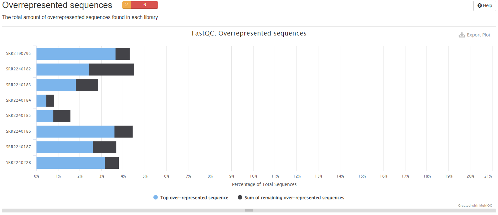

# 质控
## fastqc
高通量测序数据的高级质控工具
输入FastQ，SAM，BAM文件，输出对测序数据评估的网页报告
```bash
fastqc -t 12 -o out_path sample1_1.fq sample1_2.fq
```
-o --outdir:输出路径   
--extract：结果文件解压缩  
--noextract：结果文件压缩  
-f --format:输入文件格式.支持bam,sam,fastq文件格式  
-t --threads:线程数  
-c --contaminants：制定污染序列。文件格式 name[tab]sequence  
-a --adapters：指定接头序列。文件格式name[tab]sequence   
-k --kmers：指定kmers长度（2-10bp,默认7bp） -q --quiet： 安静模式

注：
SAM(Sequence Alignment/Map)格式是一种通用的比对格式，用来存储reads到参考序列的比对信息。
SAM是一种序列比对格式标准，由sanger制定，是以TAB为分割符的文本格式。主要应用于测序序列mapping到基因组上的结果表示，当然也可以表示任意的多重比对结果。
SAM分为两部分，注释信息（header section）和比对结果部分（alignment section）。

BAM文件是SAM文件的二进制形式

### fastqc输出文件解读
测序结果到手后，我们需要评估一下测序的质量，通常采用的质控软件组合就是fastqc和multiqc，fastqc可以快速多线程质控，并且输出html结果文件。

#### why fastqc
回归本源，测序数据为什么要进行质控？  
后期的所有分析都是基于测序数据展开的，测序数据质量的高低直接影响了我们分析的结果，因此在所有分析步骤之前，我们必须要对测序的数据的质量进行评价，只有达到我们的要求的测序数据才能用于下一步分析。

#### How to use fastqc
```bash
fastqc [-o output dir] [--(no)extract] [-f fastq|bam|sam] [-c contaminant file] seqfile1 .. seqfileN

Example：
nohup fastqc -o ./fastqc_70/ -f fastq clean_* &

常用参数解释：
# 主要是包括前面的各种选项和最后面的可以加入N个文件
# -o --outdir FastQC  生成的报告文件的储存路径，生成的报告的文件名是根据输入来定的
# -f --file  输入文件的格式，支持bam/sam/bam_mapped/sam_mapped/fastq|
# --extract  生成的报告默认会打包成1个压缩文件，使用这个参数是让程序不打包
# -t --threads 选择程序运行的线程数，每个线程会占用250MB内存，越多越快咯
# -c --contaminants  污染物选项，输入的是一个文件，格式是Name [Tab] Sequence  里面是可能的污染序列，如果有这个选项，FastQC会在计算时候评估污染的情况，并在统计的时候进行分析，一般用不到
# -a --adapters  也是输入一个文件，文件的格式Name [Tab] Sequence，储存的是测序的adpater序列信息，如果不输入，目前版本的FastQC就按照通用引物来评估序列时候有adapter的残留
# -q --quiet 安静运行模式，一般不选这个选项的时候，程序会实时报告运行的状况。
```

#### 输出文件解读
使用浏览器打开输出文件夹里的.html文件，会呈现图表化的fastqc报告：

图一：


##### Summary

图一左，Summary即整个报告的目录。绿色勾勾代表PASS；黄色感叹号代表WARN；红色勾勾代表FAIL。当出现黄色时说明需要查看结果。

##### Basic Statistics
图一右上
```bash
# Encoding 指测序平台的版本和相应的编码版本号
# Total Sequences 记录了输入文本的reads的数量
# Sequence length 测序长度
# %GC 表示整体序列中的GC含量
```
##### Per base sequence quality
图一右下
```bash
# 此图中的横轴是测序序列第1个碱基到第101个碱基
# 纵轴是质量得分，Q = -10*log10（error P）即20表示1%的错误率，30表示0.1%
# 图中每个boxplot，都是该位置的所有序列的测序质量的一个统计，上面的bar是90%分位数，下面的bar是10%分位数，箱子的中间的横线是50%分位数，箱子的上边是75%分位数，下边是25%分位数
# 图中蓝色的细线是各个位置的平均值的连线
# 一般要求此图中，所有位置的10%分位数大于20,也就是我们常说的Q20过滤
# 所以上面的这个测序结果，需要把67bp以后的序列切除，从而保证后续分析的正确性
# Warning 报警 如果任何碱基质量低于10,或者是任何中位数低于25
# Failure 报错 如果任何碱基质量低于5,或者是任何中位数低于20
```

##### Per tile sequence quality

```bash
# 横轴和之前一样，代表101个碱基的每个不同位置
# 纵轴是tail的Index编号
# 这个图主要是为了防止，在测序过程中，某些tail受到不可控因素的影响而出现测序质量偏低
# 蓝色代表测序质量很高，暖色代表测序质量不高，如果某些tail出现暖色，可以在后续分析中把该tail测序的结果全部都去除
```

##### Per sequence quality scores

```bash
# 假如我测的1条序列长度为101bp，那么这101个位置每个位置Q的平均值就是这条reads的质量值
# 该图横轴是0-40，表示Q值
# 纵轴是每个值对应的reads数目
# 实例数据中，测序结果主要集中在高分中，证明测序质量良好！
```

##### Per base sequence content

```bash
# 横轴是1 - 101 bp；纵轴是百分比
# 图中四条线代表A T C G在每个位置平均含量
# 理论上来说，A和T应该相等，G和C应该相等
# 在 reads 开头出现碱基组成偏离往往是建库操作造成的，比如建库时在 reads 开头加了 barcode；barcode 的碱基组成不是均一的，酶切位点的碱基组成是固定不变的，这样会造成明显的碱基组成偏离；
# 在 reads 结尾出现的碱基组成偏离，往往是测序接头的污染造成的。
# 当所有位置的碱基比例一致现出偏差时，即四条线平行且分开，代表文库有偏差，或测序中的系统误差；
# 当部分位置碱基的比例出现偏差时，即四条线在某些位置纷乱交织，则有overrepresented sequence的污染。
# 当任一位置的A/T比例与G/C比例相差超过10%，报"WARN"；
# 当任一位置的A/T比例与G/C比例相差超过20%，报"FAIL"。
```
##### 序列平均GC含量分布图

```bash
# 横轴表示GC含量，纵轴表示不同GC含量对应的read数
# 蓝线是理论分布（正态分布，通过从所测数据计算并构建理论分布），红色是实际情况，两个比较接近判为数据良好。
# 曲线形状的偏差往往是由于文库的污染或是部分reads构成的子集有偏差（overrepresented reads）；
# 形状接近正态分布但偏离理论分布的情况提示我们可能有系统偏差；
# 如果出现两个或多个峰值，表明测序数据里可能有其他来源的DNA序列污染，或者有接头序列的二聚体污染。
# 偏离理论分布的reads超过15%时，报"WARN"；
# 偏离理论分布的reads超过30%时，报"FAIL"。
```

##### 序列平均N含量分布图

```bash
# 当出现测序仪不能分辨的碱基时会产生N
# 横轴为碱基分布，纵轴为N比率
# 当任一位置N的比率超过5%报WARN，超过20%报FAIL。
```

##### 序列测序长度统计

```bash
# 理论上每次测序仪测出的read长度是一致的，但是由于建库等因素通常会导致一些小片段
# 比如此图中，101bp是主要的，但是还是有少量的100和102bp的长度，不过数量比较少，不影响后续分析
# 当测序的长度不同时，如果很严重，则表明测序仪在此次测序过程中产生的数据不可信 
```
##### 重复序列统计

```bash
# 统计序列完全一致的reads的频率
# 横轴表示重复的次数，纵轴表示重复的reads的数目。
# 一般测序深度越高，越容易产生一定程度的重复序列。 
```
##### 冗余序列统计

```bash
# 当有某个序列大量出现时，超过总reads数的0.1%时报WARN，超过1%时报FAIL。
```
##### 接头含量

```bash
# 此图衡量的是序列中两端adapter的情况，横轴表示碱基位置，纵轴表示百分比。
# 当fastqc分析时没有选择参数-a adapter list时，默认使用图例中的4种通用adapter序列进行统计。若有adapter残留，后续必须去接头。
# 示例中adapter未完全去除
```

## multiqc
将fastqc的统计结果汇聚成一个网页可视化文件，便于查看
当比较多组的测序数据时，fastqc质控会产出的多份html文件，来回翻阅较为繁琐，为化繁为简，multiqc此时就可以上场了，multiqc会对质控结果进行整合，产出一份html文件，方便查阅。

#### 结果解读
##### 基本统计

General Statistics：所有样本数据基本情况统计
```bash
# %Dups——重复reads的比例
# %GC——GC含量占总碱基的比例，比例越小越好
# M Seqs——总测序量（单位：millions）
```

##### 序列数量统计

```bash
# 横坐标——序列的数量
# 纵坐标——样本
# unique reads——蓝色
# Duplicate reads——黑色
```
示例数据可以看出测序中的一些重复水平，这个重复水平和测序深度以及序列本身的表达情况有关。

##### 每个read各位置碱基的平均测序质量

```bash
# 横坐标——碱基的位置
# 纵坐标——质量分数
# 质量分数=-10log10p（p代表错误率），所以当质量分数为40的时候，p就是0.0001。此时说明测序质量非常好。
# 绿色区间——质量很好；
# 橙色区间——质量合理；
# 红色区间——质量不好。
```
示例数据中，大部分的样本的quality scores都在绿色区间，所以质量很好。

##### 具有平均质量分数的reads的数量

```bash
# 可以看出低质量reads占整体reads的比例（估算各颜色区域曲线下面积）
# 横坐标——平均序列质量分数
# 纵坐标——reads数
# 绿色区间——质量很好
# 橙色区间——质量合理
# 红色区间——质量不好
# 当峰值小于27时——warning
# 当峰值小于20时——fail
```
示例数据中，几乎所有数值都在绿色区间，所以质量非常好，但是如果存在50%的counts在红色区间，则表示测序结果很差，不可用。

##### 每个read各位置碱基ATCG的比例

```bash
# reads每个位置的颜色显示由4种颜色的比例混合而成，哪一个碱基的比例大，则趋近于这个碱基所代表的颜色。
# 正常情况下每个位置每种碱基出现的概率是相近的。
# 如果ATGC在任何位置的差值大于10%—则warning（橙色），如果ATGC在任何位置的差值大于20%则fail（红色）。
# 对所有reads的每一个位置，统计ATCG四种碱基的分布，

# 横坐标——碱基位置，
# 纵坐标——样本。
# %A——绿色
# %G——紫色
# %C——蓝色
# %T——红色
# 如果ATGC在任何位置的差值大于10%——warning
# 如果ATGC在任何位置的差值大于20%——fail
```
在示例数据中可以看出，前13bp部分颜色非常不均匀，也就是表示存在AGCT四种碱基的比例差异巨大的地方，这可能有过表达的序列的污染，所以8个样本都是fail。

##### reads的平均GC含量

```bash
# 横坐标——GC含量百分比
# 纵坐标——数量
# 正常的样本的GC含量曲线会趋近于正态分布曲线，曲线形状的偏差往往是由于文库的污染或是部分reads构成的子集有偏差（overrepresented reads）。形状接近正态但偏离理论分布的情况提示我们可能有系统偏差。
# 偏离理论分布的reads超过15%时——warning
# 偏离理论分布的reads超过30%时——fail
```
由示例数据可以看出，有7个偏离超过了30%，有1个在合理的偏离度内。

##### 每条reads各位置N碱基含量比例

```bash
# 当测序仪器不能辨别某条reads的某个位置到底是什么碱基时，就会产生“N”，统计N的比率。正常情况下，N值非常小。
# 横坐标——read中的位置
# 纵坐标——N的数量比
# 当任意位置的N的比例超过5%——warning
# 当任意位置的N的比例超过20%——fail
```
由图可以看出，所有的样本在所有的位置都是属于绿色区间且数值比例非常小，可以看出测序的质量很高。这应该和现在测序仪工艺的进步，电脑处理能力的提升有着很大的关系，现在的测序仪能够高质量的完成测序。

##### 序列样本长度的分布情况

```bash
# 在这里可以看出测序的读长，也能够分析得出所有的小片段的长度分布情况，依据此我们可以判断测序效果的高低。
# reads长度不一致时——warning
# reads有0长度时——fail
```
在这里的结果呈现中，所有的结果都是在100bp，这也是二代测序的特点，测序的读长短，但是片段非常多，也就是通过将基因序列高度片段化分别同时测序，由此提高测序速度。

##### 每个序列的相对重复水平

```bash
# 横坐标——每个序列的相对重复水平
# 纵坐标——在文库中的比例
# 测序深度越高，越容易产生一定程度的duplication，这是正常的现象，但如果duplication的程度很高，就提示我们可能有bias的存在。
```

##### 文库中过表达序列的比例

```bash
# 横坐标——过表达序列的比例
# 纵坐标——样本
# 过表达序列的比例>0.1%——warning
# 过表达序列的比例>1%——warning
```
 一条序列的重复数，因为一个转录组中有非常多的转录本，一条序列再怎么多也不太会占整个转录组的一小部分（比如1%），如果出现这种情况，不是这种转录本巨量表达，就是样品被污染。

##### 接头含量

```bash
# 横坐标——碱基位置
# 纵坐标——占序列的百分比
# >5%——warning
# >10%——fail
```

#### 质控总结
fastqc帮助我们检测测序数据的质量，具体问题具体分析，后续我们还需要去除接头和质量不好的reads，去污染等操作来进行数据过滤。

# some biosoft
## conda
  Conda是一种开源的软件包和环境管理软件，有两个主要的版本，Anaconda和Miniconda，前者包含一些常用软件包，后者是精简版，根据需要安装软件包。
  Miniconda 是一个 Anaconda 的轻量级替代，默认只包含了 python 和 conda，但是可以通过 pip 和 conda 来安装所需要的包。


## sratoolkit
sratoolkit 是NCBI提供的用于处理来自SRA数据库测序数据的一个工具包。

sratoolkit可以将.sra文件转换为 .fstaq.gz文件的工具。

注：sra是二进制文件，在Linux下如果用less去查看，它会显示这是个二进制文件，你是否确定打开它。一般我们分析测序数据，是用fastq文件打开分析，所以就需要转格式。

此外，可以利用prefetch命令从NCBI网站下载SRA accession no.的列表文件

注：SRA是NIH的高通量测序数据的主要档案，存档来自各种高通量测序平台的原始测序数据和比对信息，比如Illumina。

### prefetch命令

```bash
Usage:
  prefetch [options] <SRA accession | kart file> [...]
  Download SRA or dbGaP files and their dependencies
  
  prefetch [options] <SRA file> [...]
  Check SRA file for missed dependencies and download them

  prefetch --list <kart file> [...]
  List the content of a kart file
```


prefetch相关参数：(需要将prefetch -o参数改为-O，因为下载的是多个文件)

  -o|--output-file <file>          Write file to <file> when downloading single file
  -0--output-directory <directory) Save files to <directory>

### fastq-dump命令：从SRA文件中提取fastq文件
```bash
Usage:
  fastq-dump [options] <path> [<path>...]
  fastq-dump [options] <accession>


accessions(s)：list of accessions to process

Use option：
--gzip 将转换出的fastq文件以gz格式输出，可以节省空间
--split-3 把pair-end测序分成两个文件输出
-X 拆分出指定的reads数目，默认拆分所有reads，一个read就是fastq的四行数据（老师为了上课测试，设置25000条reads，真实数据不需要加这个参数！！！）
-O 输出文件夹名
```

## cutadapt
用于去除测序接头

## Trim Galore
使用perl脚本编写的工具，是对cutapater和fastqc命令的封装。可以自动检测接头并调用cutapater进行

## hisat2: 基因组比对工具
由于测序仪机器读长的限制，在构建文库的过程中首先需要将DNA片段化，测序得到的序列只是基因组上的部分序列。为了确定测序reads在基因组上的位置，需要将reads比对回参考基因组上，这个步骤叫做mapping。

##  Ensembl
Ensembl是一个脊椎动物基因组的基因组浏览器，支持比较基因组的研究，进化，序列变异和转录调控。Ensembl可以注释基因，计算多重比对，预测调节功能和收集疾病数据。Ensembl工具集合包括BLAST、BLAT、BioMart和变异效应预测器(VEP)(支持所有物种)。

有许多个模块可供搜索，分别是Gene、Transcript、Variant、Phenotype、Stuctural Variation等。

gtf文件即基因组注释文件

## Trimmomatic：数据过滤软件
NGS 原始数据过滤对后续分析至关重要，去除一些无用的序列也可以提高后续分析的准确率和效率。Trimmomatic 是一个功能强大的数据过滤软件。

## Parallel命令：并行分析工具
```bash
Usage:

parallel [options] [command [arguments]] < list_of_arguments
parallel [options] [command [arguments]] (::: arguments|:::: argfile(s))...
cat ... | parallel --pipe [options] [command [arguments]]


常用选项：
::: 后面接参数
:::: 后面接文件
-j | --jobs   并行任务数
-N  每次输入的参数数量
--xargs会在一行中输入尽可能多的参数
-xapply 从每一个源获取一个参数（或文件一行）
--header  把每一行输入中的第一个值做为参数名
-m   表示每个job不重复输出“背景”（context）
-X   与-m相反，会重复输出“背景文本”
-q  保护后面的命令
--trim  lr 去除参数两头的空格，只能去除空格，换行符和tab都不能去除
--keep-order/-k   强制使输出与参数保持顺序 --keep-order/-k
--tmpdir/ --results   都是保存文件，但是后者可以有结构的保存
--delay  延迟每个任务启动时间
--halt  终止任务
--pipe    该参数使得我们可以将输入（stdin）分为多块（block）
--block  参数可以指定每块的大小

{1}
```

## perl命令:perl语言解释器
负责解释执行perl语言程序。
```bash
语法:perl(选项)(参数)

选项:
-n: 增加了循环的功能,使你可以一行一行来处理文件
-e: 可以让Perl程序在Perl命令行上运行.
-w：输出有用的警告信息；
-U：允许不安全的操作；
-c：仅检查文件的语法；
-d：在调试下运行脚本程序。

参数:
文件：要运行的perl脚本程序。
```
## $1


## 一般在三个网站下载参考基因组：Ensembl、NCBI和UCSC：
参考基因组：对于人类来说，目前比较常用的参考基因组有hg19、hg38、GRCh37、GRCh38。hg系列是UCSC的叫法，GRCh系列是NCBI和Ensembl的叫法。同一版本的序列是一样的，hg19对应GRCh37，hg38对应GRCh38。

注释文件：三个来源同一版本的DNA序列虽然相同，但是它们的注释是不同的，更新频率也不一样。

NCBI 的注释是refseq数据集，UCSC 和 Ensembl 注释都将其作为自己的一个子集，如UCSC 的refGene。

而UCSC 的注释比较混乱，同样ID的基因会出现在不同链或不同染色体位置上。Ensembl的注释通常比UCSC更多（例如snRNA、miRNA、假基因，所以噪音更多一点），但是ID处理比较好，所以ID更容易进行转换。

Ensembl还经常更新它的注释，更新一次作为一个版本发布。不同的来源的基因组序列名称不一样，1号染色体在 UCSC 中是 chr1，而在 Ensembl的基因组和GTF文件中是1。

使用时序列和注释要统一，UCSC的基因组序列需要对应使用UCSC的gtf/gff3注释文件，Ensembl则对应使用其同一版本对应的gtf/gff3注释文件。
GeneCode（http://www.gencodegenes.org/）也可以下载人类和小鼠的基因注释文件。

选择注释资源应遵循的原则：当进行强调可重复性和稳健的基因表达估计的研究时，优先选较为简单的基因组注释，如 RefGene。当进行更具探索性的研究时，更全面的注释更优，比如选择Ensembl。而UCSC则不太建议使用。


#### 总结

Gene model会影响基因表达量乃至差异表达基因的筛选，尤其是不同gene model对某些基因的长度、junction位点注释有出入；

Ensembl的注释相对更加准确，基因更多；

推荐人鼠用GENCODE，谁让它出自最权威的ENCODE呢，其他物种用Ensembl。


# Reference
conda介绍：https://blog.csdn.net/invalidsyntax/article/details/120743789
SAM文件：https://www.jianshu.com/p/9c99e09630da
RNA-seq tips：https://www.51xxziyuan.com/54/539.html
Ensembl、NCBI和UCSC：https://www.jianshu.com/p/017e5a565070
sratoolkit配置网站：https://github.com/ncbi/sra-tools/wiki/02.-Installing-SRA-Toolkit
Fastqc-1:https://cloud.tencent.com/developer/article/1703057
Fastqc-2:https://zhuanlan.zhihu.com/p/20731723
multiqc-1：https://www.jianshu.com/p/85da4dcc6020
fastq-dump命令：https://www.jianshu.com/p/70b3d2534e96
parallel:https://www.jianshu.com/p/cc54a72616a1
